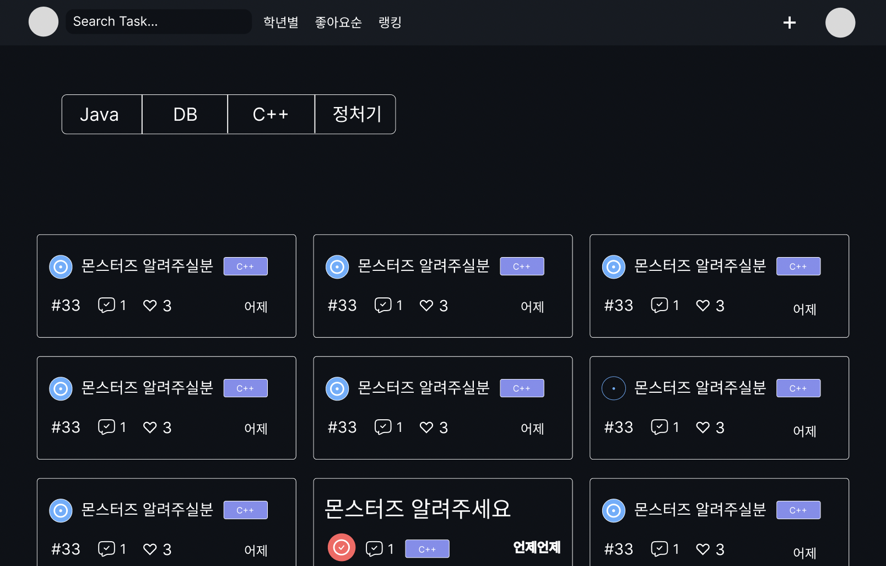
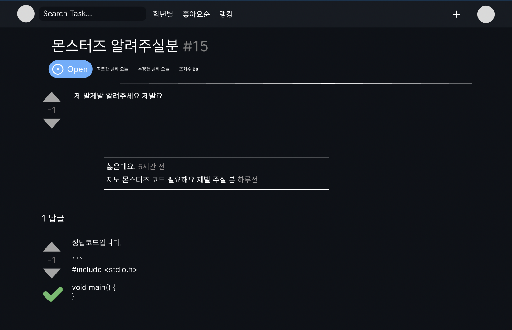

# 주제
- 특정 과목들은 할 때마다 과제를 내주는데, 수업은 듣지 않지만 과제는 제출하고 싶은 학생들을 위한 과제 질문/답변 웹사이트

# 핵심기능
- 과목마다 여러 질문글 작성
- 댓글과 답변 등록 및 답변 채택
- 내 프로필에 있는 저장된 질문글
- 채택된 질문글은 #숫자 형태로 따로 공유

# 전체적인 기능
- 질문글 작성, 수정, 삭제
- 질문글 전체 조회, 과목별 조회, 학년별 조회
- 질문글 키워드로 검색, #숫자로 검색
- A가 알람을 받고 싶은 과목 게시글을 인터셉터에 과목을 추가하면 과목 카테고리 안에서 질문글이 생성되면 알람이 옴
- A가 작성한 질문글에 답변이 달리면 A한테 “답변이 등록되었습니다!” 알람이 옴
- A가 작성한 질문글에 댓글이 달리면 A한테 “댓글이 등록되었습니다!” 알람이 옴
- 댓글 작성, 수정, 삭제
- 댓글 전체조회
- 답변 작성, 수정, 삭제
- 답변 채택 → 채택되면 #숫자 형태로 따로 모아두는 곳에 저장
- 질문글 저장하기
- 내 프로필

# UI

